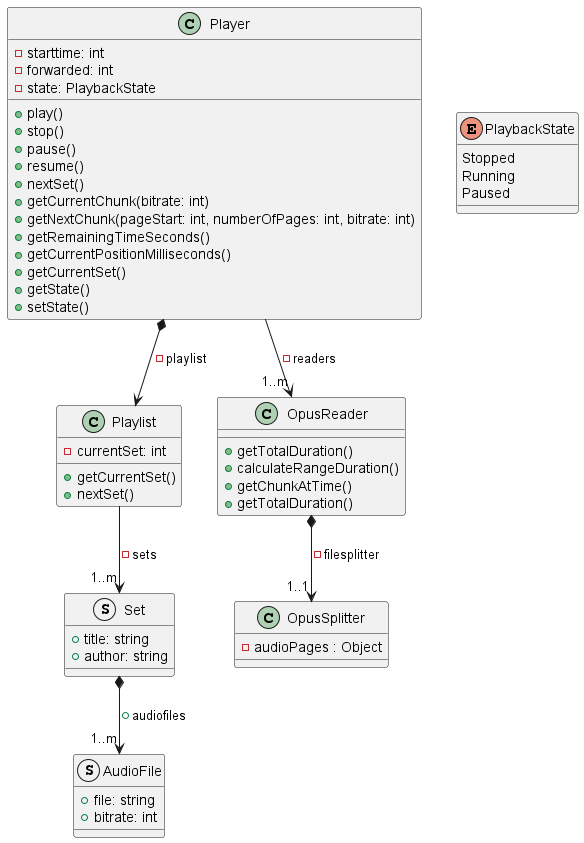

# server

Opus file player overview:



Various methods related to the concrete implementation has been omitted.

configuration file [./config/settings.json](config/settings.json) to set cors origin and port

## Environment Variables

```txt
DiscordClientID= ID of discord application
DiscordClientSecret= Secret of discord application
DiscordAppToken= Token of discord application
DiscordBotToken= Token of discord bot

DiscordAdminRole= ID of the role that should give admin perms for restricted api endpoints
DiscordChannelID= ID of the Discord channel the bot will post messages.
DiscordGuildID= Discord server ID
AdminRoleID = ID of the role needed for discord interactions

ClientRedirectUrl= URL for the client of this application / service.

PfxPath= Path to pfx key
PfxSecret= Password of the pfx key

SessionSecret= Secret of the sessions

ClientHostname= Domain of the client
ServerHostname= Domain of the server exclusive protocol
CookieDomain= Domain for the session cookie.
```

## Start options:

```txt
Save and load progress of the playlist
--usestate

Loop the playing set
--loop

Which set to start
--setindex #

How much time to skip ahead in the set. Parses the input of the format H?H:MM:SS, M?M:SS or plain number.
--forward time

Unix timestamp for when the player should start.
--scheduledstart unix time

The json playlist file path
--playlist path
```

## Playlists

A playlist has the following format:

```json
{
    "Sets": [
        "sets/my first set yay/set.json",
        "sets/slimy beat party/set.json",
        "sets/my first set part 2/set.json"
    ]
}
```

To make the relativity of the files work, the playlist file, and the sets it
references, must be in the following structure:

```
pathtoplaylist/playlist.json
pathtoplaylist/sets/*
```

More about set generation in [./tools/README.md](tools/README.md)

This structure avoids the need to move folders around when you create a new
playlist. The json itself is just an array of the set.json files to be played,
and the order of the sets is given the index of the array. In the
_config/settings.json_, the path to the playlist.json can be defined.
